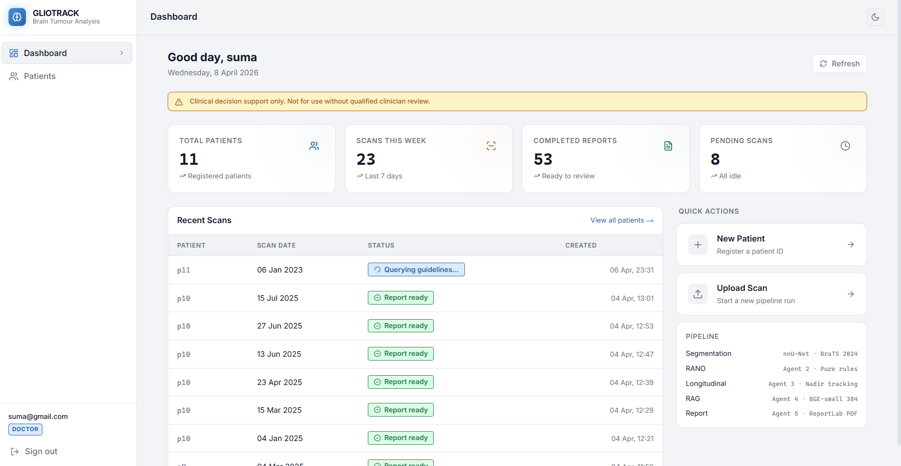
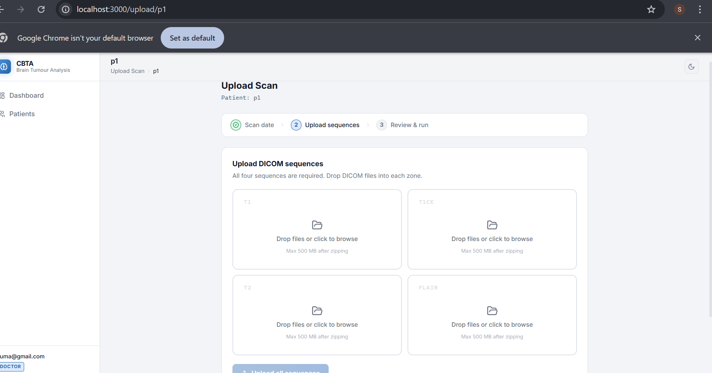
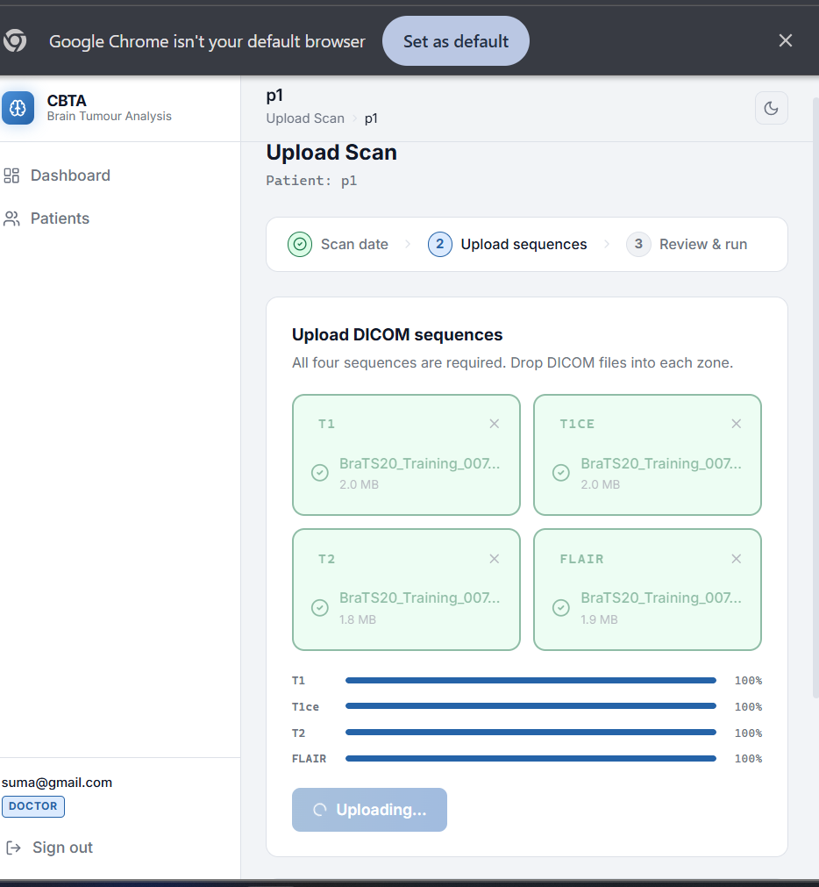
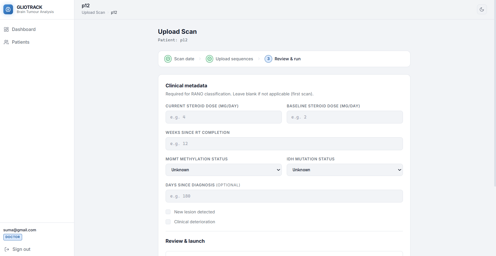
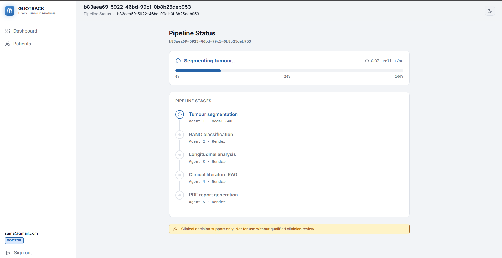
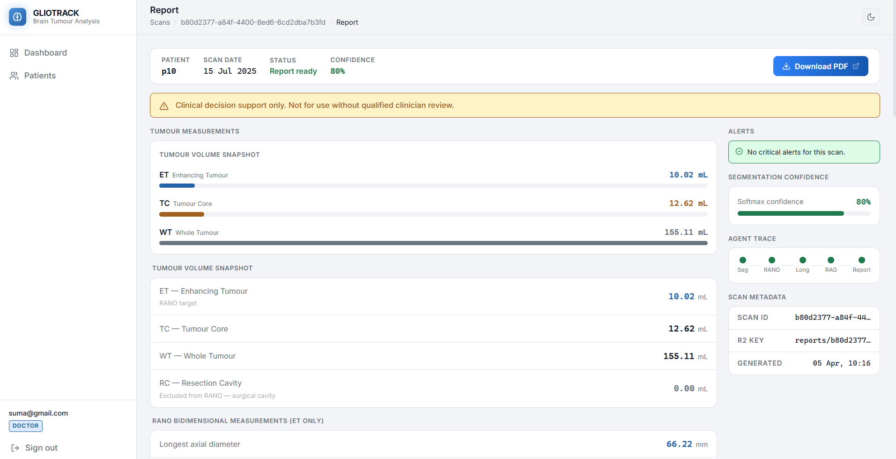
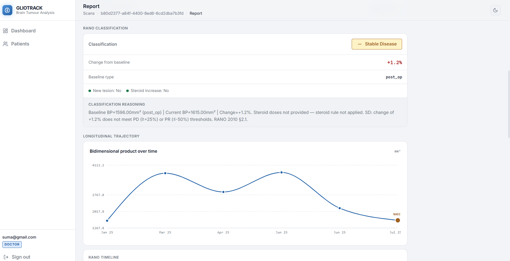
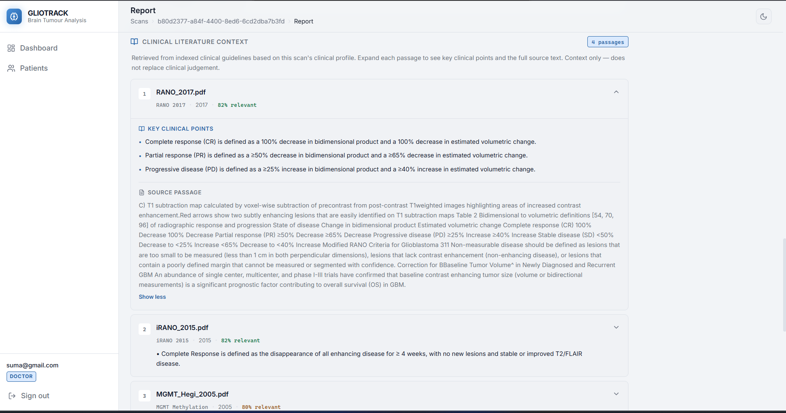
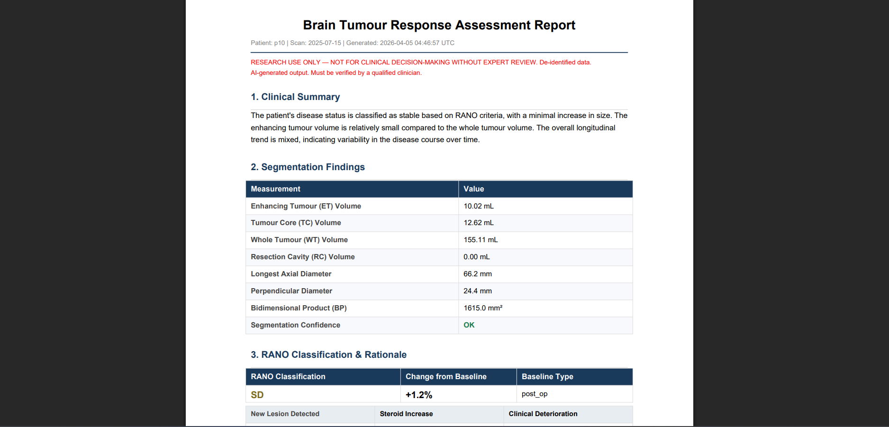
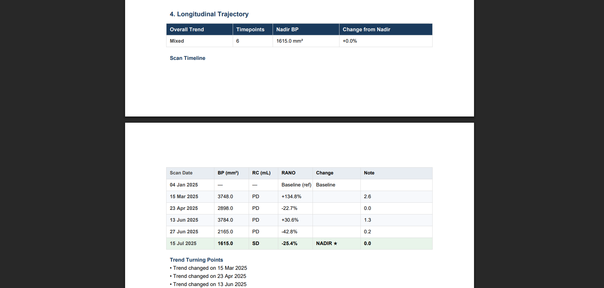

# GlioTrack

**Autonomous Multi-Agent Clinical Decision Support System for Post-Treatment Glioblastoma MRI Analysis**

> Academic prototype — NOT for clinical use without expert review.

GlioTrack is a five-agent autonomous pipeline that ingests post-treatment glioblastoma MRI scans and produces structured RANO 2010 response classifications, longitudinal tumour trajectory analysis, RAG-grounded clinical context, and a fully formatted PDF report — with no manual intervention between upload and report.

---

## Screenshots

### Dashboard


---

### Upload — Empty State


---

### Upload — Filled with DICOM Sequences


---

### Clinical Metadata Entry


---

### Pipeline Execution — 5 Agents Live


---

### Tumour Measurements Report


---

### RANO Classification & Longitudinal Trajectory


---

### Clinical Literature RAG Context


---

### Generated PDF Report — Clinical Summary


---

### Generated PDF Report — Longitudinal Trajectory Table


---

## System Architecture

```
Browser (Next.js 14 + Tailwind CSS)
    │
    ▼
FastAPI Backend (Render.com)
    │
    ├── Agent 1 — nnU-Net v2 Segmentation       (Modal GPU · NVIDIA A10G)
    │            BraTS 2024 post-treatment weights
    │            Outputs: ET / NEC / ED / background masks
    │
    ├── Agent 2 — RANO 2010 Classification       (deterministic rule engine)
    │            Bidimensional measurement · CR / PR / SD / PD / CR_provisional
    │
    ├── Agent 3 — Longitudinal Tracking          (nadir-referenced)
    │            Per-patient trajectory · % change from nadir · steroid flag
    │
    ├── Agent 4 — Clinical RAG                   (Qdrant Cloud · BAAI/bge-small-en-v1.5)
    │            Retrieves relevant passages from RANO 2010, iRANO 2015, RANO-BM guidelines
    │
    └── Agent 5 — Report Generation              (Groq llama-3.3-70b-versatile · ReportLab)
                 Hallucination-guarded PDF · clinical summary + longitudinal table
    │
    ▼
Supabase (PostgreSQL metadata) + Cloudflare R2 (NIfTI files + PDF reports)
```

---

## Validation Results

External validation on the **RHUH-GBM dataset** (patient RHUH-0032, 3 timepoints) and internal validation on **MU-Glioma-Post** (26 patients, 156 scans — TCIA).

| Sub-region | Dice Score |
|---|---|
| Enhancing Tumour (ET) | **0.847** |
| Tumour Core (TC) | **0.801** |
| Whole Tumour (WT) | **0.883** |

RANO 2010 classification agreement: verified against ground-truth radiologist assessments across RHUH-GBM timepoints.

---

## Tech Stack

| Layer | Service | Purpose |
|---|---|---|
| GPU Inference | Modal.com (A10G) | nnU-Net v2 segmentation |
| Backend | Render.com (FastAPI) | Orchestration + API |
| Database | Supabase (PostgreSQL) | Patient metadata |
| File Storage | Cloudflare R2 | NIfTI scans + PDF reports |
| Vector DB | Qdrant Cloud | RAG embeddings |
| LLM | Groq (llama-3.3-70b-versatile) | Report generation |
| Frontend | Vercel (Next.js 14) | UI |

---

## MRI Preprocessing Pipeline

```
dcm2niix → N4 bias correction → rigid co-registration → 
1mm isotropic resampling → HD-BET skull stripping → z-score normalisation
```

Input sequences required: **T1, T1ce, T2, FLAIR** (all four mandatory)

BraTS 2024 filename convention: `t2f` → FLAIR · `t2w` → T2 · `t1n` → T1 · `t1c` → T1ce

---

## Local Setup

### 1. Clone and install

```bash
git clone https://github.com/sumashree29/GLIOTRACK--Brain-Tumour-Analysis
cd GLIOTRACK--Brain-Tumour-Analysis
pip install -r requirements.txt
cp .env.example .env
# Fill in all values in .env
```

### 2. Supabase

1. Create a project at [supabase.com](https://supabase.com)
2. SQL Editor → paste `scripts/supabase_schema.sql` → Run
3. Copy Project URL and Service Role Key into `.env`

### 3. Cloudflare R2

1. Storage → R2 → Create bucket: `brain-tumour-scans`
2. Manage R2 API tokens → Create token (Read/Write)
3. Copy endpoint URL, Access Key ID, Secret into `.env`

### 4. Qdrant Cloud

1. Create free cluster at [cloud.qdrant.io](https://cloud.qdrant.io)
2. Copy cluster URL and API key into `.env`

### 5. Groq

1. Sign up at [console.groq.com](https://console.groq.com)
2. Create API key → add as `GROQ_API_KEY` in `.env`

### 6. Modal GPU worker

```bash
pip install modal
modal setup
python scripts/setup_modal_volumes.py
python modal_workers/deploy.py
# Copy the printed webhook URL → MODAL_WEBHOOK_URL in .env
```

Upload BraTS 2024 nnU-Net weights:
```bash
modal volume put nnunet-weights /local/path/to/Dataset001_BraTS /weights/Dataset001_BraTS
```

### 7. Ingest clinical guidelines (RAG)

```bash
python scripts/ingest_knowledge_base.py \
    --docs-dir /path/to/guidelines \
    --map '{"RANO_2010.pdf": ["RANO 2010", 2010], "iRANO_2015.pdf": ["iRANO 2015", 2015]}'
```

### 8. Run locally

```bash
uvicorn app.main:app --reload --port 8000
# Swagger docs: http://localhost:8000/docs
```

### 9. Run validation

```bash
# Unit tests only (no credentials needed)
python scripts/validate_pipeline.py --unit-only

# Full integration test
python scripts/validate_pipeline.py
```

---

## Deploy to Render + Vercel

**Backend (Render)**
1. Push to GitHub → Render → New Web Service → connect repo
2. Build command: `pip install -r requirements.txt`
3. Start command: `uvicorn app.main:app --host 0.0.0.0 --port 8000`
4. Add all `.env` values as Environment Variables in Render dashboard

**Frontend (Vercel)**
- Deploy `frontend/` to Vercel or any static host (GitHub Pages, Cloudflare Pages)
- Update `window.BTS_API_BASE` in `frontend/index.html` with your Render URL

---

## Locked Constraints

| Parameter | Value |
|---|---|
| LLM | llama-3.3-70b-versatile |
| Embedding model | BAAI/bge-small-en-v1.5 (dim=384) |
| RAG vector dim | 384 — fixed, changing requires Qdrant rebuild |
| RANO PR threshold | ≤ −50% bidimensional product |
| RANO PD threshold | ≥ +25% bidimensional product |
| ET label | 3 (nnU-Net BraTS convention) |
| Connectivity | 26 |
| GPU polling interval | 15s · max 80 attempts (20 min) |

---

## Known Limitations

- Not HIPAA/GDPR compliant — de-identified academic data only
- ±10% diameter error can approach ±25% RANO threshold at borderline cases
- Intra-patient co-registration is rigid only (SimpleITK) — no deformable registration
- CR_provisional requires confirmatory scan ≥4 weeks for CR_confirmed
- Dice scores set to 0.0 when ground truth labels unavailable

---

## Author

**Sumashree** · B.Tech Data Science, GRIET Hyderabad  
[LinkedIn](https://linkedin.com/in/sumashree-dornala) · [GitHub](https://github.com/sumashree29)
